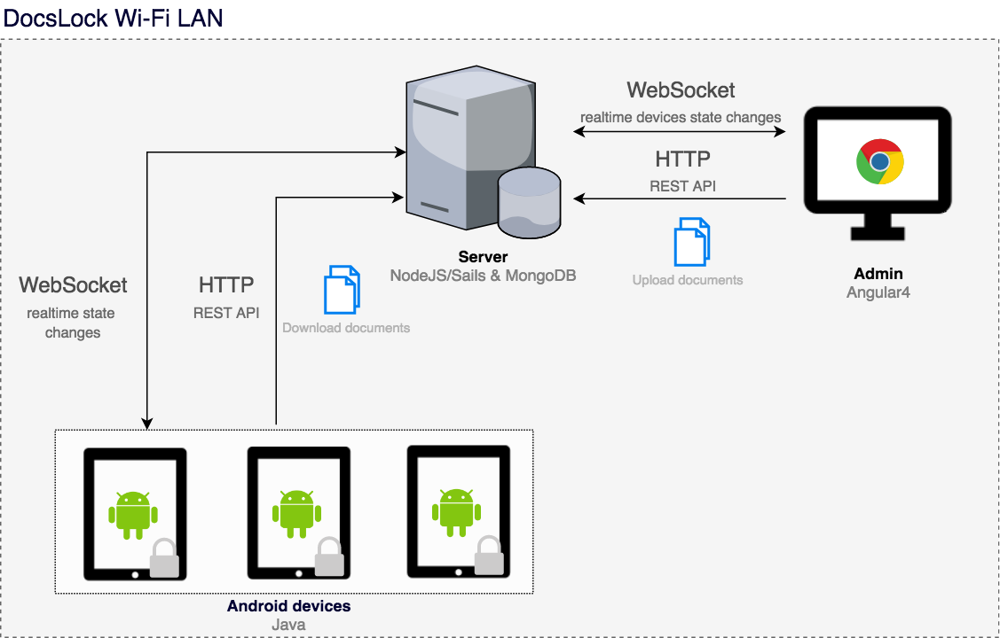

# DocsLock
Android documents reader for courses or exams. PDFs can be synced by the administration application and devices can be locked and then unlocked. 


## Getting started
### Architecture
DocsLock is divised into three components : 
- an **android application** which can be installed on desired devices
- a **client application** to administrate the devices and sends the documents
- a **server** to make the communication between devices and application, serves client application and REST API 

The android application need to be installed on devices. The LAN can be disconnect from internet.

### Prerequisites
- android application are tested and works on android 7.0
- a local WiFi LAN needs to be configured and needs to contains the server and devices (no other devices for security reasons, c.f. Limitations) 

### Dependencies used
- *Client* : [Angular4](https://angular.io/), [Angular Material](https://material.angular.io/) and [socket.io](https://socket.io/)
- *Server* : [MongoDB](https://www.mongodb.com/), [Sails.js 0.12](https://sailsjs.com/) and [socket.io](https://socket.io/)
- *Android* : [retrofit2](http://square.github.io/retrofit/) and [barteksc/AndroidPdfViewer](https://github.com/barteksc/AndroidPdfViewer)

### Limitations
For reasons of time, there are multiple *security issues*. Communications are not in HTTPS, devices are not authenticated and client administration application are not secured by a password. For these reasons you need to configure a **private Wifi LAN only used for this application**. If not, others computer could change devices states. Packets could be snooping and attacked by a MITM.

Other warning : **don't give unlocked devices**. They could go to the administration application and change unlock/lock the other devices. 

We want to fix theses security issues in next release. The current release is conceived as a *Proof of Concept*.

## Installation
- clone the project `git clone https://github.com/maximeburri/DocsLock`
- for the **android application**, install android studio and open with existing source on `android-app`
- for the **server** : 
  - install MongoDB ([installation MongoDB](https://docs.mongodb.com/manual/installation/))
  - install npm ([Installation NPM](https://www.npmjs.com/get-npm)) 
  - install npm global dependencies 
    ```
    npm install -g sails
    npm install -g @angular/cli
    ```
  - install npm dependencies : `npm install` in `docslock/client`, then in `docslock/server`

## Deployment
- in a terminal, start MongoDB (`sudo service mongod start` for ubuntu)
- in a terminal to `docslock/server` make `sails lift --prod`. The API is disponible on port `1337`
- in a terminal to `docslock/client` make `ng serve --host 0.0.0.0 --prod`. The API is disponible on port `4200`. A better alternative is to make `ng build` and host the `build` folder with nginx for example
- install .apk on devices. Set the server ip to `http://<ip api>:1337`


## Development
Equivalent to deployment with `sails lift` and `ng serve` commands.

## Next steps
The project is in pause mode and just some bugs will be fixed. If the project will be restarted, the priority will be give to :
- make communication over HTTPS (easy)
- authenticates with OAuth devices (long)
- add users managment for administration application (long) or protect by a single password (easy)

## Authors
This project is made for [HEPIA](http://hepia.hesge.ch/) initied by [Florent GLUCK](https://github.com/florentgluck) and developped by (c.f. [Contributors](https://github.com/maximeburri/DocsLock/graphs/contributors)): 
- [Maxime BURRI](https://github.com/maximeburri)
- [Salvatore CICCIU](https://github.com/sa)